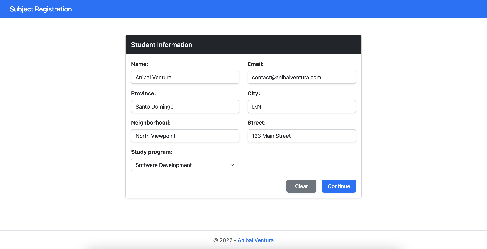
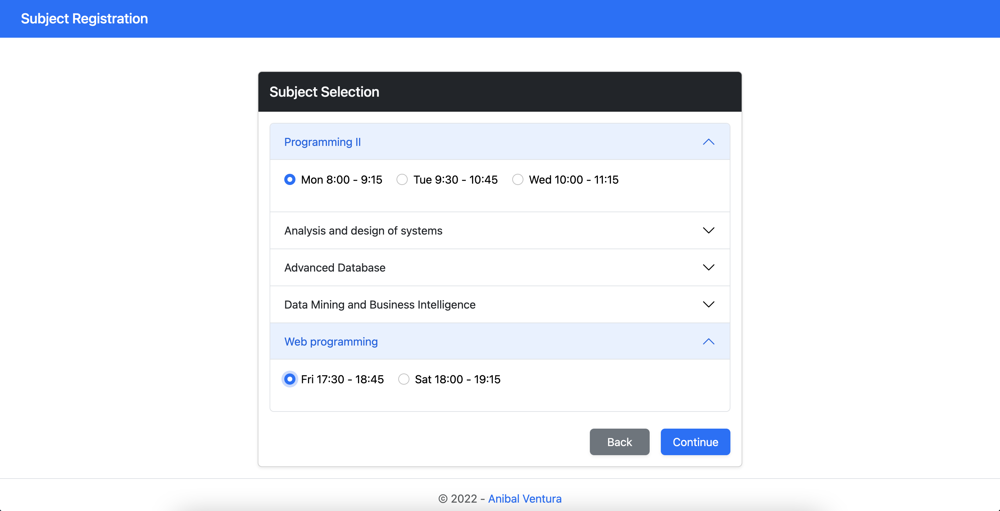
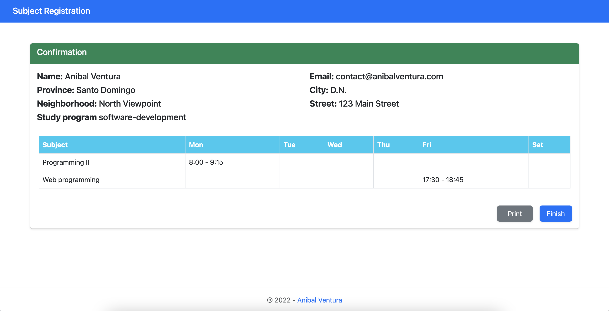

# Subject Registration

[](https://jquery.com)
[](https://getbootstrap.com/)
[](LICENCE.md)

<div align="center">
  
  
  
</div>

Subject inscription system made with jQuery and Bootstrap.

Click [here](https://anibalventura.com/subject-registration-web/) to see a live preview.

## Features

- Form validation.
- Clear form.
- Persist data in selection process.
- Print generated subjects selection.

## Dependencies

- [Bootstrap v5.2.0-beta1](https://getbootstrap.com/)
- [jQuery v3.6.0](https://jquery.com)
- [toastr v2.1.1](https://codeseven.github.io/toastr/)
- [jQuery Confirm v3.3.4](https://craftpip.github.io/jquery-confirm/)

## Build

Download/clone project and open `index.html`

## License

```xml
MIT License

Copyright (c) 2022 Anibal Ventura
```
